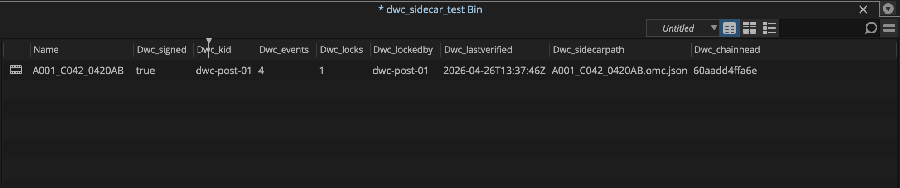

# Avid Media Composer integration

DWC sidecars project into an Avid bin via the per-day `dwc-columns-YYYY-MM-DD.ale` file produced by `dwc ale-export` or `dwc watch --emit-ale`. After importing master clips through the editorial team's normal ingest path, an editor merges the ALE to attach the eight `DWC_*` provenance fields onto each clip's bin metadata.

**Verified** against Avid Media Composer 24.10.0.58607 on macOS, 2026-04-26 (plan §7.1 dry-run). Avid is the canonical ALE consumer for this format; this validation is what closes the ALE-track exit criterion in spirit.

## What you get

After merging the DWC ALE against a bin clip, the eight `Dwc_*` columns appear in the bin view with their values populated:

| Column           | Reading                          |
|------------------|----------------------------------|
| `Dwc_signed`     | `true` / `false`                 |
| `Dwc_kid`        | kid of tip-of-chain event        |
| `Dwc_events`     | total signed event count         |
| `Dwc_locks`      | number of locks on the sidecar   |
| `Dwc_lockedby`   | kid of most recent lock event    |
| `Dwc_lastverified` | ISO-8601 UTC at ALE generation |
| `Dwc_sidecarpath`  | sidecar filename               |
| `Dwc_chainhead`  | first 12 hex of tip-event hash   |

**Avid case-normalises the column names.** The emitter writes `DWC_Signed`; Avid stores and displays it as `Dwc_signed` (Title-case prefix, lowercase suffix). The data is intact; only the surface label changes. If a downstream system reads metadata back out of Avid (e.g. via an Avid export ALE) it has to do case-insensitive matching on the `dwc_` prefix to keep round-trip identity.

The 14-character-truncation folklore for Avid custom column names is **not a hard rule** in 24.10.0. `Dwc_lastverified` (16 chars) and `Dwc_sidecarpath` (15 chars) come through in full.

## Requirements

- **Avid Media Composer 2024.10** or later (the validated build is 24.10.0.58607). Earlier versions almost certainly work — Avid has supported ALE custom columns for two decades — but the exact merge UX and case-normalisation behaviour was confirmed only against this build.
- A `<clip-basename>.omc.json` sidecar adjacent to each clip on disk. Produce with `dwc watch` or `dwc batch`.
- A per-day `dwc-columns-YYYY-MM-DD.ale` produced by `dwc ale-export` or `dwc watch --emit-ale`.

## Production workflow

The DWC integration with Avid follows Avid's standard ALE-merge pattern, not the ALE-as-clip-source pattern:

1. **Editorial imports the master clips** through whatever path is normal for the show — AMA link, file import, AAF round-trip, etc. The clips arrive in a bin with their natural Tape Name and Start TC populated by the original camera/DIT metadata.
2. **Editorial merges the day's DWC ALE** onto those clips: select the bin → File → Input → Import… → pick the `.ale` → Avid matches each ALE row to its corresponding bin clip by Tape Name + Start TC and attaches the `DWC_*` columns.
3. **Editor enables the eight `Dwc_*` columns** in the bin view: right-click the column header → Choose Columns… → tick the `Dwc_*` entries (now visible at the bottom of the list) → the columns populate with values from the ALE merge.

Step 3 is one-time per bin; the column choice persists across project sessions.

## Known quirks

Discovered during the §7.1 dry-run; documented here so editorial doesn't lose time to the same blind spots:

- **Merge requires Tape Name + Start TC match.** Avid's ALE-merge match key is Tape + Start TC, not Name. A bin clip whose Tape is blank (or whose Start TC differs from the ALE row by even one frame) will fail to merge with the error `BIN_IMPORT_NO_MATCH`. Real production clips have these fields populated naturally; only test fixtures and synthesised clips usually don't.
- **Direct ALE import is a different path.** File → Input → Import… → ALE with no matching bin clip creates *new* master clip rows from the ALE. The eight `DWC_*` fields land in clip-level Custom metadata (visible via Get Info → Custom) but **do not** auto-register as bin columns. The merge path is the production-supported workflow; direct import is for offline-edit scenarios.
- **Bin column auto-creation only happens after a merge attempt.** Avid 24.10.0 doesn't list custom columns in Choose Columns… until at least one merge has been attempted against a clip in that bin. A failed merge (e.g. the `BIN_IMPORT_NO_MATCH` case) is enough to register the column entries; once registered, they remain selectable.
- **Case normalisation.** `DWC_Signed` becomes `Dwc_signed`. Title-case the first letter, lowercase everything after. Documented above.
- **The emitter's hardcoded `Start = End = 01:00:00:00` placeholder.** Sidecars without timecode metadata produce ALEs where Avid rejects the row with "out point ≤ in point" before a merge can even be attempted. Tracked as a follow-up: the emitter should default `End = Start + 1` frame as a minimum. Real production sidecars carry real timecode and don't hit this.

## How matching works

Avid's ALE-merge match algorithm (per the editor's interactive behaviour, not formally documented in 2024 release notes):

1. **Primary**: Tape Name + Start TC, both must equal exactly. A frame off in either field is a hard miss.
2. **Fallback**: clip Name. Used only when Tape Name is blank on both sides; behaviour is version-dependent.

For DWC sidecars, the emitter writes `Tape` from the source clip's reel/tape metadata as carried in the OMC asset. As long as that value matches what was set on the bin clip during the original ingest, merge succeeds first try.

## Headless / CI

There's no headless-Avid surface — Media Composer doesn't expose its ALE merge from a CLI. Production pipelines that drive Avid externally use AAF interchange instead, which is out of scope for the DWC ALE path. The integration here assumes a human in the editor doing the merge step.

## Plan §7.1 status

ALE format itself: ✓ accepted by Avid Media Composer 24.10.0.

Eight `DWC_*` columns survive transit: ✓ verified character-for-character via Get Info on the merged clip plus visible in the bin view.

Names not truncated despite some exceeding 14 chars: ✓ resolves plan §8 open question #1.

Avid track of the §7.1 ALE exit criterion: **closed**.
