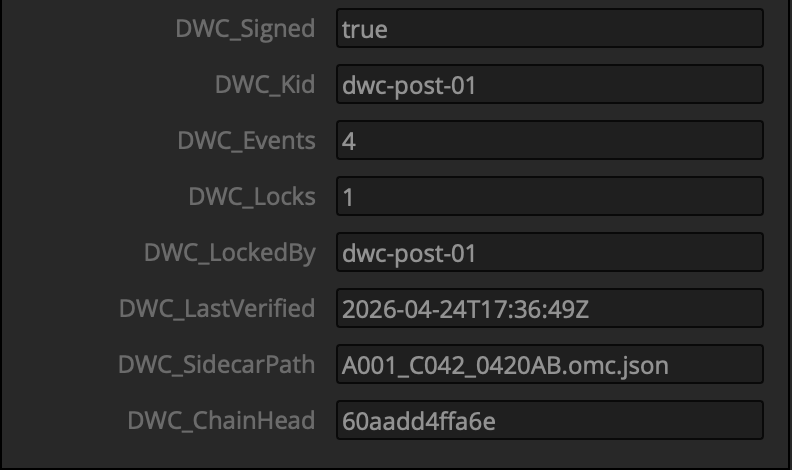

# DaVinci Resolve integration

DWC sidecars project onto Resolve's Media Pool clips via a Python script that writes eight `DWC_*` fields through `MediaPoolItem.SetMetadata`. After a one-time setup per Resolve install (adding the eight custom fields), the same script handles every future project without further configuration.

**Verified** against DaVinci Resolve Studio 20.3.2 on macOS 15.7.5 (arm64), 2026-04-24. The `MediaPoolItem` surface this integration uses is byte-identical between the Resolve 20 and 21 scripting APIs (vendor READMEs at `resources/documentation/`), so one validation covers both.

## What you get



With the **Custom** group filter active in the Metadata inspector, you see all eight fields populated in one view:

| Field              | Reading                   |
|--------------------|---------------------------|
| `DWC_Signed`       | `true` / `false`          |
| `DWC_Kid`          | kid of tip-of-chain event |
| `DWC_Events`       | total signed event count  |
| `DWC_Locks`        | number of locks on the sidecar |
| `DWC_LockedBy`     | kid of most recent lock (or empty) |
| `DWC_LastVerified` | ISO-8601 UTC at run time  |
| `DWC_SidecarPath`  | sidecar filename          |
| `DWC_ChainHead`    | first 12 hex of tip-event hash |

Resolve has no six-slot ceiling like Silverstack's `setCustomN`, so all eight DWC fields go directly into named custom fields rather than being truncated to six.

## Requirements

- DaVinci Resolve **Studio 20.2** or later. The Create-Custom-Metadata UI used here shipped in 20.2; older Resolve stores the same fields under Project Settings → General Options → Metadata & Scene.
- For headless invocation: Python 3.6+ with `DaVinciResolveScript` on `PYTHONPATH`.
- A `<clip-basename>.omc.json` sidecar file in a known directory; produce with `dwc watch` or `dwc batch`.

## One-time setup per Resolve install — add the eight custom fields

Resolve's `MediaPoolItem.SetMetadata(key, value)` silently drops writes to fields that don't yet exist as custom metadata. There is no scripting API to create them — it's a UI step.

1. Go to the **Media** (or **Edit**) page.
2. Select any clip in the Media Pool so the Metadata inspector populates.
3. Click the **three-dot options menu** at the top of the Metadata tab → **Create Custom Metadata**.
4. For each of the eight field names, enter it exactly, pick field type **Text Input**, and tick **Show in all projects** so the field persists across future projects:
   - `DWC_Signed`
   - `DWC_Kid`
   - `DWC_Events`
   - `DWC_Locks`
   - `DWC_LockedBy`
   - `DWC_LastVerified`
   - `DWC_SidecarPath`
   - `DWC_ChainHead`
5. To review/edit/reorder later, use **Manage Custom Metadata** from the same three-dot menu.

`python3 -m dwc_sidecar.integrations.resolve.ensure_custom_fields` prints this walk-through for a DIT.

## Run it — two paths

### From inside Resolve (Workspace → Scripts → Utility)

Install the script once into the user-scope Utility folder:

```bash
cp src/dwc_sidecar/integrations/resolve/apply_dwc_metadata.py \
   ~/Library/Application\ Support/Blackmagic\ Design/DaVinci\ Resolve/Fusion/Scripts/Utility/
```

Then open the project and run **Workspace → Scripts → Utility → apply_dwc_metadata**. The menu-invocation path does not yet accept a sidecar-directory argument, so this surface is useful for re-running a previous configuration but not for parameterising a path at click time. Use the headless path below for production pipelines.

### Headless (preferred for dailies pipelines and CI)

```bash
export RESOLVE_SCRIPT_API="/Library/Application Support/Blackmagic Design/DaVinci Resolve/Developer/Scripting"
export RESOLVE_SCRIPT_LIB="/Applications/DaVinci Resolve/DaVinci Resolve.app/Contents/Libraries/Fusion/fusionscript.so"
export PYTHONPATH="$RESOLVE_SCRIPT_API/Modules/:$PYTHONPATH"
python3 -m dwc_sidecar.integrations.resolve.apply_dwc_metadata /path/to/sidecar-dir
```

All three env vars are required — `RESOLVE_SCRIPT_API` alone isn't enough; `PYTHONPATH` must include `$RESOLVE_SCRIPT_API/Modules/` so `import DaVinciResolveScript` resolves. Resolve must be running with the target project open. If Resolve's scripting permission is set to Console-only, change **Preferences → System → General → External scripting using** to **Local** first.

Expected output against the reference fixture:

```
A001_C042_0420AB → A001_C042_0420AB  (score=100, 8/8 fields)
Applied metadata to 1 clip(s).
```

The match format is `<sidecar-stem> → <clip-name>  (score=<0..100>, <ok>/<total> fields)`. A `score=100` is an exact-name match; anything `65..99` is a substring match tier. Sidecars that don't score ≥65 against any clip are silently skipped rather than being force-matched.

## Sidecar → clip matching

The script matches sidecars to clips by filename via a substring scorer ported from `~/Documents/Resolve-Tools/Import-AMF/Import_AMF.py:950–1020`. Score tiers, threshold 65:

| Score | Condition                                     |
|-------|-----------------------------------------------|
| 100   | Sidecar stem == clip name                     |
| 90    | Sidecar stem ⊂ clip name                      |
| 85    | Clip name ⊂ sidecar stem                      |
| 80    | Sidecar filename (without ext) ⊂ clip name    |
| 75    | Clip name ⊂ sidecar filename                  |
| 70    | File-path basename ⊂ clip name                |
| 65    | Clip name ⊂ file-path basename                |

One clip matches at most one sidecar — reruns are stable given the same Media Pool order.

## Known quirks

Discovered during the §7.1 dry-run; none of these are blockers, but they shape the install experience:

- **Three env vars, not one.** The integration README's original headless example showed only `RESOLVE_SCRIPT_LIB`; that isn't enough. `RESOLVE_SCRIPT_API` and `PYTHONPATH=$RESOLVE_SCRIPT_API/Modules/` are also required. Corrected in `src/dwc_sidecar/integrations/resolve/README.md`.
- **UI path for custom fields moved in 20.2.** The original integration README pointed at **Project Settings → General Options → Metadata & Scene**, which was removed in Resolve 20.2 in favour of the Metadata-inspector three-dot menu. The `ensure_custom_fields` walk-through now covers both paths so DITs on older installs aren't stranded.
- **No programmatic field creation.** `SetMetadata` will never create a field — it only writes to pre-existing ones. This is by design per Blackmagic's docs, but it's the reason `ensure_custom_fields.py` exists as a printed walk-through rather than a scripted setup.
- **`SetThirdPartyMetadata` intentionally unused.** The vendor README documents it as a separate namespace, but it's absent from the substantial Resolve prior art in `~/Documents/Resolve-Tools/` — strongly suggesting it's either broken or not surfaced in the UI. Stick with `SetMetadata` + the pre-existing-field constraint.

## Headless sanity check (no Resolve required)

The Python test harness at [`tests/test_resolve_script.py`](../../tests/test_resolve_script.py) covers the full `run()` flow against a mock Resolve — 22 assertions including scorer tier boundaries, partial `SetMetadata=False` failures, and the `ensure_custom_fields` walk-through content. Run `pytest tests/test_resolve_script.py`.
