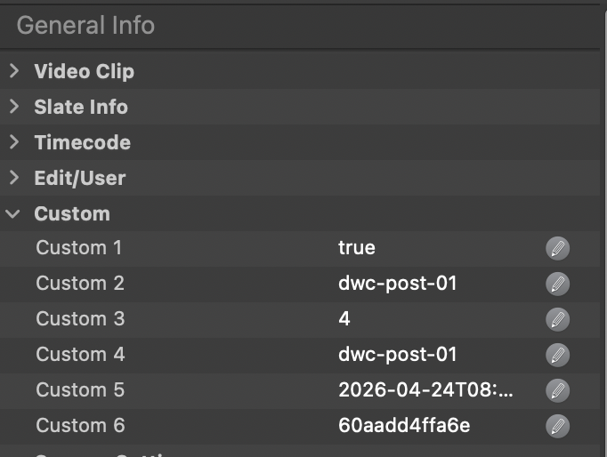

# Silverstack integration

DWC sidecars flow into Silverstack's clip inspector via a Lua ingest script. After installing the script once and attaching it to an Offload Workflow's **Register in Library** step, every ingested clip whose adjacent `<clip>.omc.json` sidecar parses cleanly gets six provenance fields written to its custom metadata slots — no human action per clip.

**Verified** against Silverstack XT 9.2.1 on macOS 15.7.5 (arm64), 2026-04-24.

## What you get

The **Custom** section of the clip inspector (General Info → Custom) shows the six fields the script writes:

| Slot      | DWC field          | Reading                   |
|-----------|--------------------|---------------------------|
| Custom 1  | `DWC_Signed`       | `true` / `false`          |
| Custom 2  | `DWC_Kid`          | kid of tip-of-chain event |
| Custom 3  | `DWC_Events`       | total signed event count  |
| Custom 4  | `DWC_LockedBy`     | kid of most recent lock (or empty) |
| Custom 5  | `DWC_LastVerified` | ISO-8601 UTC at ingest    |
| Custom 6  | `DWC_ChainHead`    | first 12 hex of tip-event hash |

The remaining two DWC columns (`DWC_Locks`, `DWC_SidecarPath`) are carried in the per-day `dwc-columns-YYYY-MM-DD.ale` file for tools that support arbitrary columns; Silverstack exposes exactly six `Custom` slots so the script trims the set to the six highest-signal fields.

To display the custom-column labels as `DWC_Signed` etc. rather than `Custom 1` etc. in the clip grid, rename the labels in **Silverstack → Preferences → Custom Metadata**. The labels persist across projects.

## Requirements

- Silverstack **XT 9.2.0+** or **Lab 9.2.0+**. The Lua scripting API shipped with Silverstack 9.2.0; earlier versions have no scriptable surface and must use the ALE path instead.
- macOS (current DWC integration target).
- A `<clip-basename>.omc.json` sidecar file adjacent to each clip on disk. Produce these with `dwc watch` or `dwc batch` before or during ingest.

## Install

1. Open Silverstack's top-level **Script** menu → the script editor.
2. In the script editor, switch scope to **Shared** (top-left dropdown). Shared scripts persist across projects.
3. Create a new script named `DWC_ApplyMetadata`. Paste the entire contents of [`src/dwc_sidecar/integrations/silverstack/apply_dwc_metadata.lua`](../../src/dwc_sidecar/integrations/silverstack/apply_dwc_metadata.lua). Save.
4. Open (or create) an **Offload Workflow**. In its **Register in Library** activity, scroll to the **Metadata Adjustment Scripts** panel → click **+ Add Lua Script → Shared → DWC_ApplyMetadata**. Save the workflow.
5. Run the offload. Every clip whose adjacent sidecar parses cleanly gets the six DWC fields written as Custom1..Custom6 during the Register-in-Library step.

A clip with no adjacent sidecar is silently ignored — Silverstack handles untracked clips in the same ingest run. Malformed sidecar JSON logs a `print()` warning and skips that clip without failing the workflow.

## Known quirks (Silverstack XT 9.2.1)

Discovered during the §7.1 dry-run, documented here so sister integrations (Resolve, YoYotta) can skip the same debugging:

- **Context tag is mandatory.** The first line of an ingest script must be `-- sst: ingest`. Without it Silverstack classifies the file as a working-copy template and it does not appear in the **+ Add Lua Script → Shared** dropdown. Hook-function names alone do not make a script an ingest script.
- **Attachment, not mere presence.** Pasting the script into Shared scope doesn't make it run. It has to be explicitly attached to the **Register in Library** activity's Metadata Adjustment Scripts list in each workflow.
- **Sandboxed `_ENV`.** Global variables created at script load (`dwc = {}`) are unreachable from hook bodies at hook-fire time — accessing them throws `'__index' chain too long; possible loop`. Same error surfaces when accessing a non-existent method or field on a Silverstack userdata. Our script avoids this by keeping helpers on a `local dwc` table captured as a closure upvalue.
- **Resource API.** `FileResource` exposes the clip's on-disk path via `:getPath()`, per the SDK reference. An earlier assumption of `:path()` produced the `'__index' chain too long` error above because metatable fallback for missing methods loops.
- **No visible ingest-script log.** Per SDK § 2.3, ingest scripts have no dedicated success surface — `print()` output is not shown in the script editor. Confirmation is the populated metadata in the clip inspector itself.

## Headless sanity check (no Silverstack required)

The Python test harness at [`tests/test_silverstack_script.py`](../../tests/test_silverstack_script.py) exercises the script end-to-end via a subprocess `lua` binary, stubbing `videoClip` / `resource` against a fixture sidecar. Seven assertions cover the happy path, hash-prefix trimming, the no-lock case, missing-sidecar no-op, malformed-JSON logging, missing-resource-method no-op, and Unicode clip names. Install Lua 5.1+ on `PATH` and run `pytest tests/test_silverstack_script.py`.

For a one-off command-line reproduction against a real clip + sidecar pair, use the throwaway driver at `/tmp/dwc-silverstack-dryrun/drive.lua` created during the §7.1 dry-run — see `src/dwc_sidecar/integrations/silverstack/README.md`.
